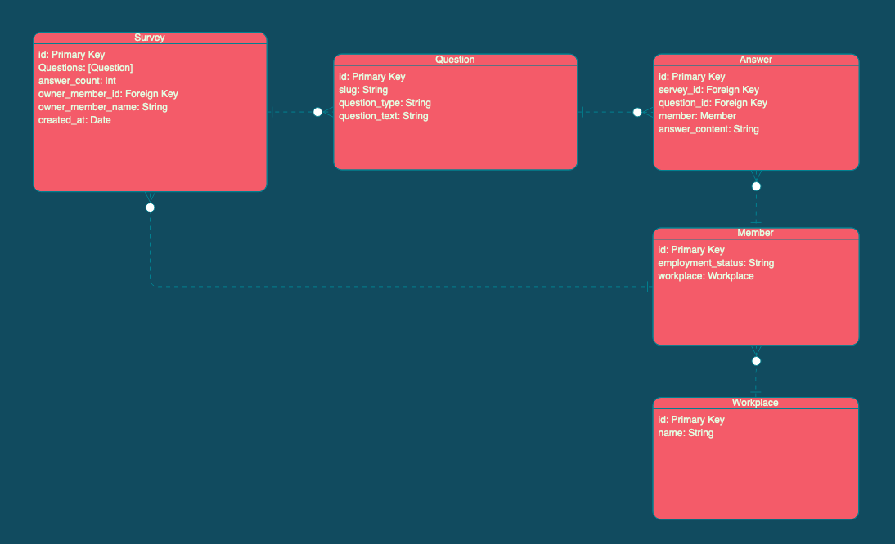
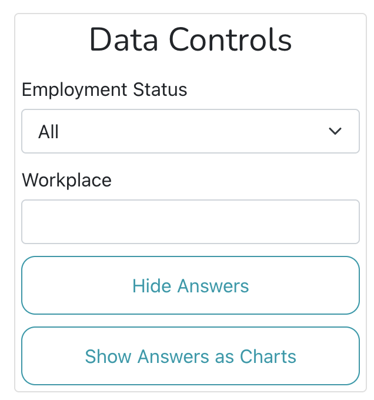

# Organise Tech Test

My response to the Organise Tech Test - an addition of filtration criteria
to an App that displays data gathered from surveys.

## Usage

1. Clone this repo and open the directory in your terminal.
2. `yarn install`
3. (Hopefully) access the app on http://localhost:3000/

## Design Process

### Data Structure

After reading the brief and having the kick-off meeting, I felt that understanding the data structures that I needed to
manipulate would be a good way to understand the problem.

I set up a Postman collection for the task, and mapped each of the routes.
From these routes, I mapped the different types of data and their relationships. This was a really useful reference throughout the task:

- **Survey**: meta information about a Survey, including an array of its questions and a Unique ID.
- **Question**: The data about the specific question asked, with a unique ID, type, and the actual question text.
  - Types seen: 'y/n', 'radio'
- **Answer**: a response to a question, containing:
  - A unique ID
  - A Survey ID and a Question ID
  - A **Member**
  - The content of their answer
- **Member**: an individual who has responded to a survey, with:
  - A unique ID
  - An employment status, seen: 'employed', 'self_employed', 'retired', 'other'
  - A **Workplace**
- **Workplace**: the place of work of a particular member
  - Null if irrelevant to that particular member (e.g. retired)
  - Unique ID and name if it is relevant

### Filtering the Results

With the data structure in mind, I could explore the code in the App more easily. I identified that there were two places
where there was data being fetched that I needed to filter, in both _SurveyAnswers_ and _SurveyChartAnswers_.

Both of these elements are children of SurveyList, so I decided to add the filtering criteria as state here in order to pass
the same filters down to both at the same time.

The user sets the state of the filter with 2 inputs - I built these to be quite generic elements that we can reuse for any
stateful input or selector going forward. I grouped these inputs with the existing buttons as a card that contains all data control
elements.

A user can set the desired filters, which are then passed down to the children components and filtered out of the data with a helper function.

### Making the app responsive

As 80% of the target users have been identified as mobile users, I then spent some time making the app responsive. I knew that
I wouldn't have the time to add much manual styling (though I did implement SASS to make the little styling that I did do easier).
Bootstrap was therefore a good choice, as there is a responsive table built in. It's not the most aesthetic implementation, and I would
have definitely consulted with a designer if I was working in a production environment, but the end result has left the app functional
on mobile.

## What would I do after MVP?

Once I had reached a working version of the app that I felt hit the technical requirements of the brief, I planned features
and ideas that I would likely begin to implement as a next step. I worked on a couple of the ideas with some of the remaining time that I had budgeted for myself, and the others remain outstanding:

- [ ] If there are no results, display a message (on charts AND on Text).
- [x] Add some very basic styling to improve the look of the app.
- [x] Format the timestamp to be more human readable.
- [ ] Ensure that the app works well with screen readers.
- [x] Refactor to use folders for components on everything (I like to do this as you can have a really clear separation of concerns for your components, with a specifically scoped SCSS file and unit tests nestled alongside really neatly.)
- [ ] Testing (I like TDD, but I'm not great at it in React currently).
- [x] A loading element as data is pulled from the server.
- [ ] Redux brought in as now state is starting to get complicated.
- [ ] In SurveyAnswers, filter the results before slicing the array to 100, and track the count of matches.
- [ ] Refactor server calls to be in their own utility files
- [ ] Use React Router to create routes for each survey that display SurveyList as a view, with a separate view for selecting a survey to begin with, currently all logic sitting in SurveyList for this though.
